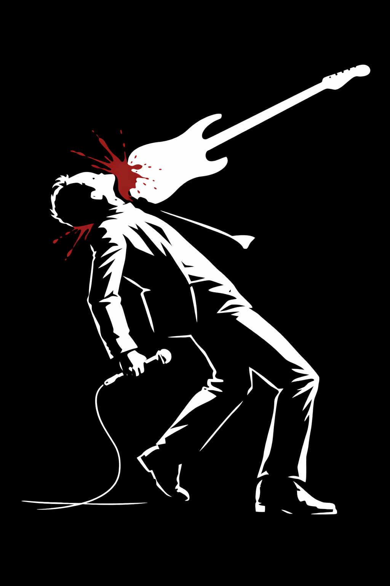

<!-- DO NOT EDIT. Generated by scripts/build-book.R from the Markdown
     in case-studies/. Edit the source case files and re-run the build. -->

::: {.case-meta}
**Detective:** Wilbert Wright  ·  **Difficulty:** Medium ●●○

**Topics:** Public health, Data visualization, Survival analysis  ·  **Fallacies:** Right censoring, Survivorship bias
:::

## The crime scene

Recently, scientists announced a striking discovery: your choice of music genre may determine how long you live.

Drawing on a large database of deceased popular musicians, the researchers compared the average age at death across musical genres. Blues, jazz, country, and gospel musicians, they reported, tend to live into their 60s and 70s—roughly in line with the general population. But newer genres tell a darker story. Rock musicians die younger. Punk and metal younger still. And at the far end of the spectrum lie rap and hip-hop, where the average age at death appears to plunge to around 30 years.

The figure is dramatic. Lines slope downward as genres become more modern. Compared to life expectancy in the U.S. population, some genres appear almost more dangerous than war. The implication is hard to miss: certain musical cultures come with deadly lifestyles, and the music itself may be part of the problem.

The media picks it up immediately. Headlines warn aspiring artists. Parents clutch their children's playlists a little tighter. Somewhere, a jazz saxophonist nods smugly.

But you are not convinced. At first glance, the story seems straightforward: genres shape behavior, behavior shapes risk, risk shapes mortality. But the pattern is too clean, too orderly. And every good detective knows that the most dangerous suspect is often the one missing from the lineup. Where is the fatal flaw?

## Exhibit 1: Death by Beat

*Average age at death of popular musicians by genre, compared to U.S. life expectancy*

## Exhibit 2: Map of suspects

*Causal diagram underlying the study's implied argument*

## The interrogation

1. What is shown on the vertical/y axis of Exhibit #1?

2. Which information do the thick lines in Exhibit #1 provide, and which do the thin lines?

3. According to the crime scene, which is the deadliest of all genres for both female and male musicians?

4. What causal relationships are implied in Exhibit #2?

5. Does Exhibit #1 consider only musicians who have died, only living ones, or both?

6. What is your estimate for the average age of living rap musicians, and what for living jazz musicians?

7. Does the plot provide direct information about the life expectancy of musicians? Why, or why not?

8. Could the observed pattern arise without any causal effect of genre on mortality?

9. Would the conclusion change if all musicians were followed until old age or death?

10. What is the fundamental flaw in the analysis and conclusions?

------------------------------------------------------------------------

[**→ Reveal the solution**](../solutions/solution-01.qmd){.solution-link}

