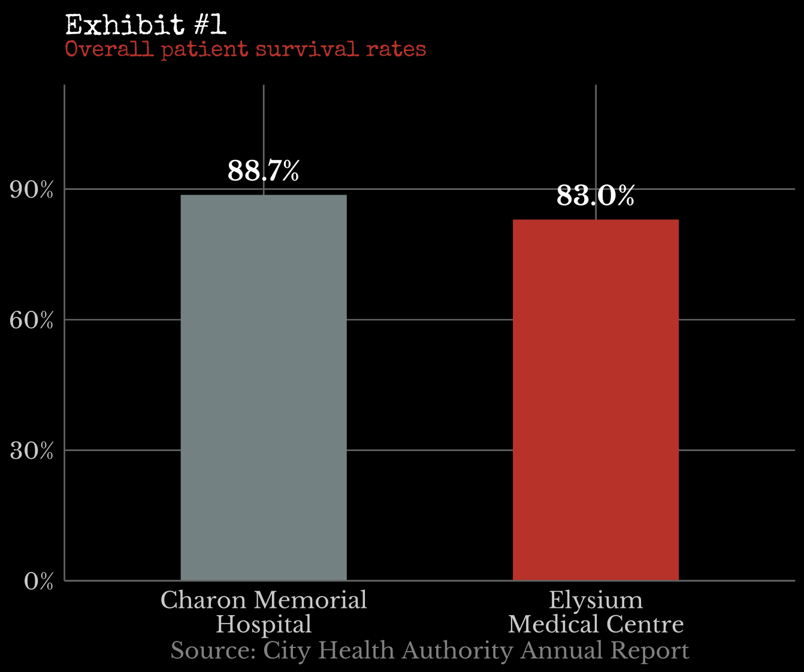

<!-- DO NOT EDIT. Generated by scripts/build-book.R from the Markdown
     in case-studies/. Edit the source case files and re-run the build. -->

::: {.case-meta}
**Detective:** Wilbert Wright  ·  **Difficulty:** Hard ●●●

**Topics:** Public health, Hospital quality, Aggregation  ·  **Fallacies:** Simpson's paradox, Confounding
:::

## The crime scene

**The Metropolitan Ledger**, 14 March — *"City's Worst Hospital Exposed"*

> *"Elysium Medical Centre has been failing its patients. New data obtained by The Ledger reveals that just 83.0% of patients admitted to Elysium survive their stay — nearly six percentage points below the 88.7% survival rate posted by crosstown rival Charon Memorial Hospital. Health officials are calling for an urgent public inquiry. 'The numbers don't lie,' said one city councillor. 'Families deserve to know which hospital is safe and which is not.'"*

The story runs above the fold with a bar chart. The implication is unambiguous: one hospital is a house of healing, the other a house of death — and the data proves it.

Wilbert Wright read the article over a morning coffee. A single bar chart in a daily newspaper is not an investigation. It is a verdict without a trial. And something about this one bothered him. He used his morning walk for a trip to the city health authority. A clerk disappeared into the back and returned with the annual report of the city's hospitals — a fat, spiral-bound slab that landed on the counter with a thud.

Buried in Appendix D, past the budget tables and the board minutes, was what he was looking for: survival figures broken down by admitted diagnosis. He worked through them for the better part of an hour. When the picture finally snapped into place, he allowed himself a small smile. "Just as I thought," he said, to no one in particular. "A classic."

Ten minutes later, he called his friend Ed Simpson, a seasoned science reporter at *The Metropolitan Ledger* — not involved in the notorious front-page story, but one of the few people at the paper who would understand the problem immediately. Wright explained it in three sentences.

"Ed," he said, "your bosses have some work to do."

The following morning, *The Metropolitan Ledger* published a correction on page two. The record had been set straight. Can you tell how?

## Exhibit 1: The Chart That Started It All

*Overall patient survival rates, Elysium Medical Centre vs. Charon Memorial Hospital*

## Exhibit 2: The Suspects — Hospital Profiles

|  | **Charon Memorial Hospital** | **Elysium Medical Centre** |
|---|---|---|
| Founded | 1887 | 1962 |
| Licensed beds | 620 | 285 |
| Annual budget | $220 million | $210 million |
| Designation | Community hospital | Regional trauma centre; specialist referral hub |
| Patient satisfaction rating | 4.1 / 5 | 4.7 / 5 |

## Exhibit 3: Survival Rates by Condition and Hospital

| Condition | Charon patients | Charon survivors | Charon survival | Elysium patients | Elysium survivors | Elysium survival |
|---|---|---|---|---|---|---|
| Bone fractures | 1,200 | 1,128 | 94.0% | 200 | 192 | 96.0% |
| Cardiac events | 500 | 415 | 83.0% | 300 | 255 | 85.0% |
| Gunshot wounds | 100 | 53 | 53.0% | 400 | 300 | 75.0% |
| **All patients** | **1,800** | **1,596** | **88.7%** | **900** | **747** | **83.0%** |

## The interrogation

1. What survival rates does *The Metropolitan Ledger* report for Elysium Medical Centre and Charon Memorial Hospital, and what conclusion does the article draw from those numbers?

2. Look at Exhibit 2. What differences between the two hospitals stand out? What might Elysium's designation as a "Regional trauma centre and specialist referral hub" suggest about the kinds of patients it is built to receive?

3. Elysium Medical Centre has a higher patient satisfaction rating (4.7 / 5) than Charon Memorial Hospital (4.1 / 5), yet its overall survival rate is lower. How would you explain this apparent contradiction? Think carefully about who is in a position to leave a rating — and who is not.

4. Elysium was founded more than 70 years after Charon, yet it has a slightly smaller total budget. However, Elysium treats roughly half as many patients per year. What does that imply about the cost of treating each patient at each hospital, and what might drive that difference?

5. Look at Exhibit 3. For patients admitted with bone fractures, which hospital has the higher survival rate?

6. For patients admitted with cardiac events, which hospital has the higher survival rate?

7. For patients admitted with gunshot wounds, which hospital has the higher survival rate?

8. Now look at the patient counts in Exhibit 3. How many gunshot wound patients does each hospital treat per year? What does this gap tell you about how differently the two hospitals' patient populations are composed?

9. What happens to a hospital's overall survival average when nearly half its patients arrive with the most life-threatening injuries on the list — while its rival handles such cases less than 6% of the time?

10. Is there a fundamental flaw in the way *The Metropolitan Ledger* compared the two hospitals? What would a fair evaluation of hospital quality need to account for before drawing any conclusions?

------------------------------------------------------------------------

[**→ Reveal the solution**](../solutions/solution-02.qmd){.solution-link}

