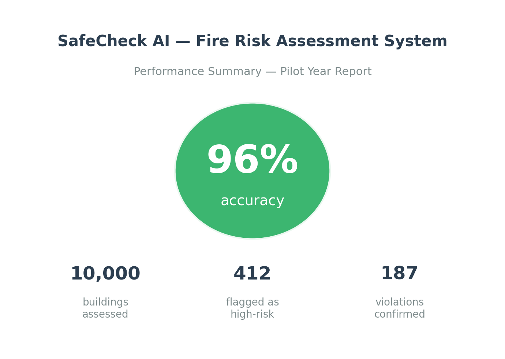

<!-- DO NOT EDIT. Generated by scripts/build-book.R from the Markdown
     in case-studies/. Edit the source case files and re-run the build. -->

::: {.case-meta}
**Detective:** Nora Nightingale  ·  **Difficulty:** Medium ●●○

**Topics:** Machine learning, Public safety, AI governance  ·  **Fallacies:** Base rate neglect, Accuracy paradox
:::

## The crime scene

**The Metropolitan Ledger**, 11 October — *"City's New AI Catches Fire Hazards Before They Strike"*

> *"Mayor Denton Crale yesterday unveiled the results of a year-long pilot of SafeCheck, a machine learning system developed by ARCA Systems to identify residential buildings at high risk of fire code violations. The system achieved an accuracy of more than 97 percent, flagging 412 buildings across the city. Follow-up inspections confirmed violations in 187 of those buildings — a result the Mayor called 'a major step toward a safer Ravenport.' The city now plans to expand SafeCheck to all 10,000 residential buildings on its registry and to reduce its inspector workforce by 40 percent. 'This is what evidence-based governance looks like,' said Maximilian Sorel, ARCA Systems' Head of Government Partnerships. 'The data speaks for itself.'"*

Nora Nightingale read the press release over breakfast in her Portside office. She set down her coffee. She circled one number — 97 percent — and wrote two words in the margin.

*Base rate.*

She pulled up the city's building registry. It was publicly available, updated annually, and contained a field she doubted Maximilian Sorel had ever looked at: the proportion of Ravenport residential buildings with recorded fire code violations in the five years prior to the pilot. Roughly two percent. About 200 buildings out of 10,000.

She opened a spreadsheet and typed four numbers.

It took eleven minutes.

When she was done, she looked at what the numbers meant. SafeCheck had flagged 412 buildings as high-risk. It had been right about 187 of them. That left 225 buildings whose owners had received an official city hazard designation — inspectors at their door, notices in their file, a permanent mark in the ARCA database — for nothing. More than half of every alarm the system raised was a false alarm.

The 97 percent accuracy was real. It was also almost entirely composed of the system correctly identifying clean buildings as clean — a task that required no machine learning whatsoever, and that a system flagging nothing at all would also accomplish, at 98 percent accuracy.

She called the city's data officer. She explained it in two minutes. There was a long pause on the other end of the line.

"So the 97 percent," the data officer said.

"Is mostly the system," Nightingale said, "doing nothing useful, very reliably."

Three weeks later, the city quietly announced it was reviewing the timeline for the inspector workforce reduction. No reason was given. The *Ledger* did not follow up. Nightingale wrote a short note to the *Caldenveld Review*, which ran it as a letter to the editor, below a piece about urban planning.

## Exhibit 1: SafeCheck at a Glance

*Key figures from the SafeCheck pilot, as reported by ARCA Systems and the City of Ravenport*

## Exhibit 2: The Full Picture — SafeCheck Predictions vs. Reality

*Actual outcomes for all 10,000 residential buildings in the pilot*

| | **Violation confirmed** | **No violation** | **Total** |
|---|---|---|---|
| **SafeCheck: flagged** | 187 | 225 | 412 |
| **SafeCheck: not flagged** | 13 | 9,575 | 9,588 |
| **Total** | 200 | 9,800 | 10,000 |

## The interrogation

1. What does Mayor Crale claim about SafeCheck's accuracy, and what decision does the city plan to make on the basis of that claim?

2. Look at Exhibit 2. Of the 10,000 buildings in the city registry, how many actually had fire code violations? What percentage of all buildings does that represent?

3. Of the 412 buildings that SafeCheck flagged as high-risk, how many turned out to actually have violations?

4. What does the 97 percent accuracy figure actually count? Look carefully at which numbers in Exhibit 2 are the largest. Which category of buildings contributes most to that figure?

5. Imagine a system that flagged no buildings at all — one that simply cleared every building as safe, every time. What overall accuracy would that system achieve on this same data? What does your answer tell you about the usefulness of overall accuracy as a metric here?

6. Calculate the positive predictive value (PPV): of all the buildings SafeCheck flags as high-risk, what share actually has violations? Express it as a percentage.

7. You own a building in Ravenport. One morning you receive a letter from the city informing you that SafeCheck has classified your building as high-risk and that an inspector will visit within the week. Based on Exhibit 2, what is the probability that your building actually has a violation?

8. Exhibit 2 shows 13 buildings with genuine violations that SafeCheck did not flag. What is the term for this type of error, and why does it matter for the city's plan to reduce its inspector workforce by 40 percent?

9. Maximilian Sorel says SafeCheck "dramatically outperforms random chance." Is this true? And if it is, does it settle the question of whether SafeCheck is fit for the purpose the city is using it for?

10. Is there a fundamental flaw in how the city evaluated SafeCheck's performance? What would be a more appropriate measure of success for a system like this, and why?

------------------------------------------------------------------------

[**→ Reveal the solution**](../solutions/solution-03.qmd){.solution-link}

