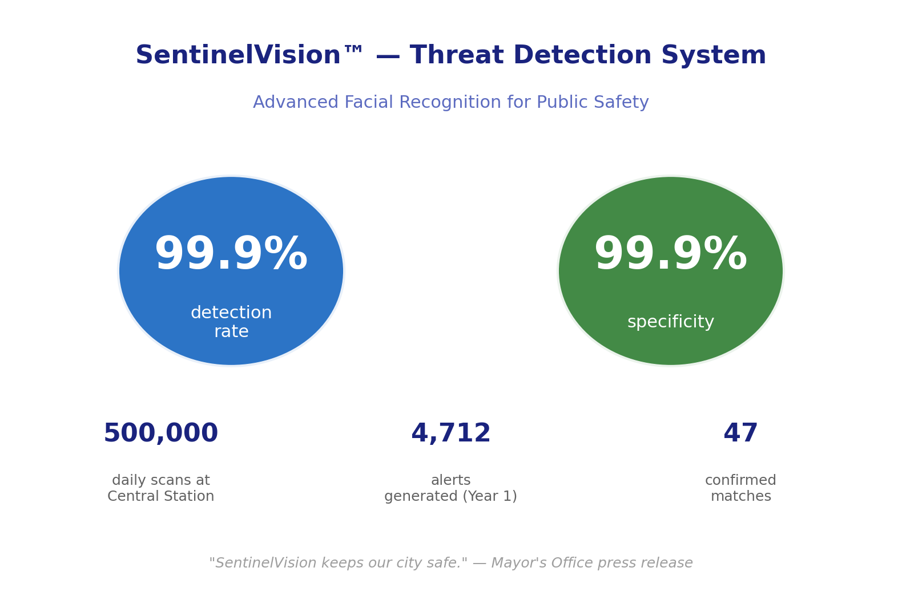

<!-- DO NOT EDIT. Generated by scripts/build-book.R from the Markdown
     in case-studies/. Edit the source case files and re-run the build. -->

::: {.case-meta}
**Detective:** Nora Nightingale  ·  **Difficulty:** Hard ●●●

**Topics:** Machine learning, Surveillance, Algorithmic fairness  ·  **Fallacies:** Base rate neglect, False positive paradox
:::

## The crime scene

The briefing room on the third floor of Ravenport Police Department headquarters held thirty people and the quiet pride of an institution that had staked something on a decision it still believed in.

Detective Chief Inspector Orla Mace stood at the lectern. Behind her, a slide read: **SENTINELVISION: YEAR ONE**.

ARCA Systems had sold the RPD SentinelVision — a facial recognition system for Ravenport Central Station — eighteen months earlier, on the strength of an independent performance evaluation that cited 99.9 percent accuracy and a specificity figure Mace had described, in her original pitch to the Police Commissioner, as "near-perfect." The system had been live for twelve months. It had scanned five million faces. It had raised 5,048 alerts. Of those, 48 had led to confirmed matches with persons on the national watchlist.

"Forty-eight dangerous individuals," Mace told the room. "Identified. Removed from circulation. That is forty-eight cases that did not become incidents."

She did not mention the other 5,000.

Nora Nightingale had been contracted by the Directorate for Algorithmic Oversight to produce an independent performance assessment. She had attended the briefing as an observer. She had not been given the floor.

She had brought a single sheet of paper. On it, she had drawn a tree.

The tree started with five million. It split: 50 persons of interest who had actually traveled through the station during the year, and 4,999,950 who were not. Each branch then divided again — flagged by SentinelVision, or not. The numbers at the ends of the branches came directly from the RPD's own performance data.

She submitted her assessment to the DAO six days later. The key finding, on page one, read:

*Of the 5,048 alerts raised by SentinelVision during the pilot year, 5,000 — 99.1 percent — were raised against travelers who were not on the watchlist and posed no threat. These individuals were detained, questioned, and had their facial data retained in ARCA's review database. The system's positive predictive value is 0.95 percent.*

The DAO opened a formal review. SentinelVision continued to operate during the review. DCI Mace declined to comment publicly. Maximilian Sorel told the *Ledger* that the system was "performing within documented parameters."

It was. That was precisely the problem.

## Exhibit 1: SentinelVision — Year One Performance Summary

*Results from the pilot year, as reported by ARCA Systems to the Ravenport Police Department*

## Exhibit 2: The Full Picture — What the Alerts Actually Represented

*Natural frequency tree for all 5,000,000 travelers scanned during the pilot year*

*Underlying data:*

| | **On watchlist** | **Not on watchlist** | **Total** |
|---|---|---|---|
| **SentinelVision: flagged** | 48 | 5,000 | 5,048 |
| **SentinelVision: not flagged** | 2 | 4,994,950 | 4,994,952 |
| **Total** | 50 | 4,999,950 | 5,000,000 |

## The interrogation

1. DCI Mace reports that SentinelVision raised 5,048 alerts and produced 48 confirmed matches. What conclusion does she draw from these figures, and what information does her presentation leave out?

2. Of the five million travelers scanned during the pilot year, how many were actually on the national watchlist? Express this as a rate per 100,000 travelers. What does this number tell you about how rare the event the system is trying to detect actually is?

3. SentinelVision's specificity is 99.9 percent — meaning it correctly clears 999 out of every 1,000 travelers who are not on the watchlist. Given that approximately 4,999,950 travelers were not on the watchlist, calculate how many of them were nonetheless incorrectly flagged.

4. The system's sensitivity is 96 percent — meaning it detects 96 out of every 100 actual watchlist persons. Of the 50 persons of interest who passed through the station during the year, how many did SentinelVision fail to detect entirely?

5. Calculate the positive predictive value: of every 100 SentinelVision alerts, approximately how many correspond to an actual watchlist person?

6. Each alert triggers a detention procedure: the traveler is escorted to a secondary screening room, their identity is checked against the watchlist, and their facial image is added to an ARCA review log. Describe what a typical day looks like for the SentinelVision operations team, based on your calculation in question 5.

7. SentinelVision's overall accuracy is 99.9 percent — a figure that is mathematically correct. What does this figure actually count, and why is it almost entirely uninformative about whether the system is doing its job?

8. Nightingale's natural frequency tree in Exhibit 2 presents the same information as the percentage figures, but differently. Explain in your own words what the tree shows — and why this way of presenting the data makes it easier to see what is actually happening.

9. Research has consistently found that facial recognition systems have significantly higher false positive rates for darker-skinned individuals and for women than for lighter-skinned men — in some studies, the error rate gap runs five to ten times higher. If SentinelVision shares this property, how does it change the picture you have already constructed? Who, specifically, bears the cost of the system's errors?

10. Is there a fundamental flaw in how SentinelVision was evaluated before deployment? What questions should the Directorate for Algorithmic Oversight have required ARCA Systems to answer before the system went live?

------------------------------------------------------------------------

[**→ Reveal the solution**](../solutions/solution-04.qmd){.solution-link}

