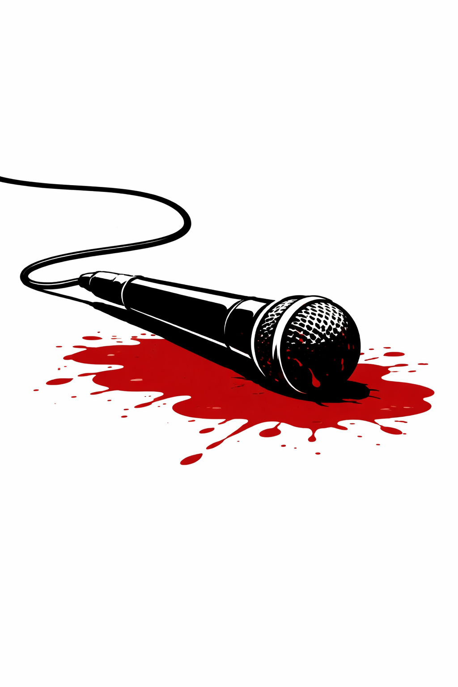

# Death by Beats

## The crime scene

Recently, scientists announced a striking discovery: your choice of music genre may determine how long you live.

Drawing on a large database of deceased popular musicians, the researchers compared the average age at death across musical genres. Blues, jazz, country, and gospel musicians, they reported, tend to live into their 60s and 70s—roughly in line with the general population. But newer genres tell a darker story. Rock musicians die younger. Punk and metal younger still. And at the far end of the spectrum lie rap and hip-hop, where the average age at death appears to plunge to around 30 years.

The figure is dramatic. Lines slope downward as genres become more modern. Compared to life expectancy in the U.S. population, some genres appear almost more dangerous than war. The implication is hard to miss: certain musical cultures come with deadly lifestyles, and the music itself may be part of the problem.

The media picks it up immediately. Headlines warn aspiring artists. Parents clutch their children's playlists a little tighter. Somewhere, a jazz saxophonist nods smugly.

But you are not convinced. At first glance, the story seems straightforward: genres shape behavior, behavior shapes risk, risk shapes mortality. But the pattern is too clean, too orderly. And every good detective knows that the most dangerous suspect is often the one missing from the lineup. Where is the fatal flaw?

## Exhibit 1: Death by Beat

*Average age at death of popular musicians by genre, compared to U.S. life expectancy*

## Exhibit 2: Map of suspects

*Causal diagram underlying the study's implied argument*

## The interrogation

1. What is shown on the vertical/y axis of Exhibit #1?

2. Which information do the thick lines in Exhibit #1 provide, and which do the thin lines?

3. According to the crime scene, which is the deadliest of all genres for both female and male musicians?

4. What causal relationships are implied in Exhibit #2?

5. Does Exhibit #1 consider only musicians who have died, only living ones, or both?

6. What is your estimate for the average age of living rap musicians, and what for living jazz musicians?

7. Does the plot provide direct information about the life expectancy of musicians? Why, or why not?

8. Could the observed pattern arise without any causal effect of genre on mortality?

9. Would the conclusion change if all musicians were followed until old age or death?

10. What is the fundamental flaw in the analysis and conclusions?

## Answers to the questions

1. It shows age at death (in years). In other words, it summarizes how old musicians were when they died.

2. The thick line shows the average age at death among deceased musicians in each genre. The thin lines show something else — the life expectancies of fans of the respective genre.

3. According to the "crime scene" framing and the visual impression of Exhibit #1, rap/hip-hop appears deadliest for both female and male musicians. It is depicted as having the lowest age at death.

4. Genre is portrayed as shaping lifestyle (e.g., drug consumption, exposure to violence), which in turn affects death. The diagram therefore encourages a causal reading: genre → lifestyle → mortality. There is also a path from sex to death, implying that males and females have different expected ages at death.

5. It considers only musicians who have died. Living musicians do not appear.

6. A reasonable rough guess is that living rap musicians average around the 30s to early 40s, while living jazz musicians average closer to the 60s or older. The exact numbers don't matter; what matters is that the age distributions are very different.

7. No: it gives average age at death among those already dead, which is not the same as life expectancy. Life expectancy requires accounting for the large share of people who are still alive (and their remaining expected years), which the figure does not do.

8. Yes. Even if genre had zero causal effect, younger genres would still show lower average ages at death because only the early deaths can appear so far.

9. Very likely, yes. If we could observe complete lifespans for everyone (or properly account for those still alive), the dramatic genre differences in "average age at death" would shrink or potentially look very different.

10. The central flaw is right censoring: the analysis conditions on being dead, and newer genres have many more living members who cannot yet contribute late-age deaths. This confounds "genre" with "opportunity to have died at an old age," producing a misleading causal narrative.

## What went wrong

The core problem in this case is right censoring. The chart reports the average age at death for musicians in each genre, but it conditions on death having already occurred. For older genres, many musicians have lived full lifespans and died of old age. For younger genres, the only musicians who can appear in a death dataset are those who died prematurely, because the majority of musicians in those genres are still alive.

This creates a mechanical distortion: even if musicians across all genres faced identical age-specific mortality risks, newer genres would necessarily show much lower average ages at death simply because their members have not yet had the opportunity to die at older ages.

Crucially, the causal diagram omits the age distribution of musicians and the historical age of genres — variables that are strongly related both to genre and to observed ages at death. This omission induces a spurious association between genre and mortality that can easily be mistaken for a causal effect of lifestyle.

The dramatic downward trend in the chart therefore reflects who is observable, not who is at risk. The figure tells a compelling story, but it is a story created by censoring, not causation.

## Background

This case is inspired by a real and widely circulated example of scientific results being misunderstood once detached from their methodological context.

The original empirical work is by Dianna T. Kenny and Anthony Asher, who studied mortality and causes of death among popular musicians using actuarial methods and explicitly discussed the limitations imposed by censoring and cohort structure in the scholarly article to some extent.

However, a simplified visualization and popular summaries circulated widely on social media and in news coverage, often stripped of the accompanying caveats. This led to strong and misleading interpretations, including claims that some musical genres are more dangerous than war.

A detailed and influential critique of this episode appears on CallingBullshit.org, where the case is dissected as an example of how right censoring, visualization choices, and causal language can combine to produce a compelling but false narrative. That analysis provided the immediate inspiration for this case.

Importantly, this is not a story about fraud or bad faith. It is a story about how easily valid data, when summarized incautiously and viewed without context, can commit a crime against causality.

## Sources

- Kenny, D. T., & Asher, A. (2016). Life expectancy and cause of death in popular musicians: Is the popular musician lifestyle the road to ruin? *Medical Problems of Performing Artists*, 31(1), 37–44. https://doi.org/10.21091/mppa.2016.1007
- Kenny, D. T. (2015). Music to die for: How genre affects popular musicians' life expectancy. *The Conversation*. https://theconversation.com/music-to-die-for-how-genre-affects-popular-musicians-life-expectancy-36660
- Bergstrom, C. T., & West, J. D. (2017). Musicians and mortality. *Calling Bullshit: Case Studies*. https://callingbullshit.org/case_studies/case_study_musician_mortality.html
- Bellis, M. A., Hennell, T., Lushey, C., Hughes, K., Tocque, K., & Ashton, J. R. (2007). Elvis to Eminem: Quantifying the price of fame through early mortality of European and North American rock and pop stars. *Journal of Epidemiology & Community Health*, 61(10), 896–901. https://doi.org/10.1136/jech.2007.059915
