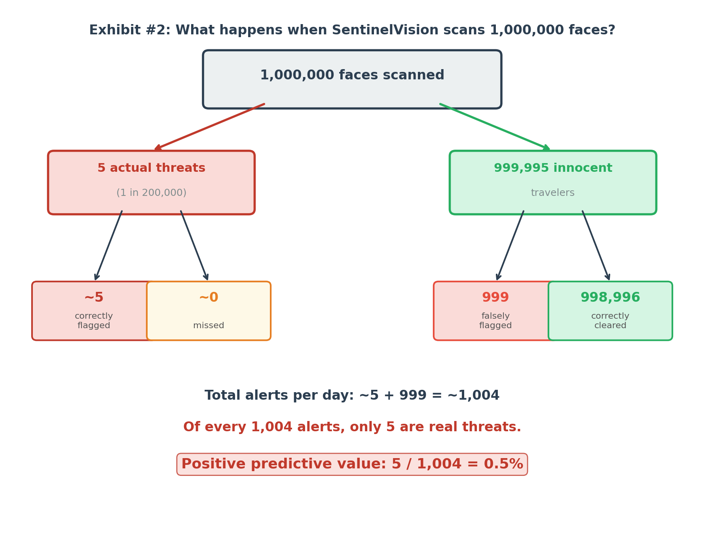

# The Watchful Eye

## The crime scene

The briefing room on the third floor of Ravenport Police Department headquarters held thirty people and the quiet pride of an institution that had staked something on a decision it still believed in.

Detective Chief Inspector Orla Mace stood at the lectern. Behind her, a slide read: **SENTINELVISION: YEAR ONE**.

ARCA Systems had sold the RPD SentinelVision — a facial recognition system for Ravenport Central Station — eighteen months earlier, on the strength of an independent performance evaluation that cited 99.9 percent accuracy and a specificity figure Mace had described, in her original pitch to the Police Commissioner, as "near-perfect." The system had been live for twelve months. It had scanned five million faces. It had raised 5,048 alerts. Of those, 48 had led to confirmed matches with persons on the national watchlist.

"Forty-eight dangerous individuals," Mace told the room. "Identified. Removed from circulation. That is forty-eight cases that did not become incidents."

She did not mention the other 5,000.

Nora Nightingale had been contracted by the Directorate for Algorithmic Oversight to produce an independent performance assessment. She had attended the briefing as an observer. She had not been given the floor.

She had brought a single sheet of paper. On it, she had drawn a tree.

The tree started with five million. It split: 50 persons of interest who had actually traveled through the station during the year, and 4,999,950 who were not. Each branch then divided again — flagged by SentinelVision, or not. The numbers at the ends of the branches came directly from the RPD's own performance data.

She submitted her assessment to the DAO six days later. The key finding, on page one, read:

*Of the 5,048 alerts raised by SentinelVision during the pilot year, 5,000 — 99.1 percent — were raised against travelers who were not on the watchlist and posed no threat. These individuals were detained, questioned, and had their facial data retained in ARCA's review database. The system's positive predictive value is 0.95 percent.*

The DAO opened a formal review. SentinelVision continued to operate during the review. DCI Mace declined to comment publicly. Maximilian Sorel told the *Ledger* that the system was "performing within documented parameters."

It was. That was precisely the problem.

## Exhibit 1: SentinelVision — Year One Performance Summary

*Results from the pilot year, as reported by ARCA Systems to the Ravenport Police Department*

## Exhibit 2: The Full Picture — What the Alerts Actually Represented

*Natural frequency tree for all 5,000,000 travelers scanned during the pilot year*

*Underlying data:*

| | **On watchlist** | **Not on watchlist** | **Total** |
|---|---|---|---|
| **SentinelVision: flagged** | 48 | 5,000 | 5,048 |
| **SentinelVision: not flagged** | 2 | 4,994,950 | 4,994,952 |
| **Total** | 50 | 4,999,950 | 5,000,000 |

## The interrogation

1. DCI Mace reports that SentinelVision raised 5,048 alerts and produced 48 confirmed matches. What conclusion does she draw from these figures, and what information does her presentation leave out?

2. Of the five million travelers scanned during the pilot year, how many were actually on the national watchlist? Express this as a rate per 100,000 travelers. What does this number tell you about how rare the event the system is trying to detect actually is?

3. SentinelVision's specificity is 99.9 percent — meaning it correctly clears 999 out of every 1,000 travelers who are not on the watchlist. Given that approximately 4,999,950 travelers were not on the watchlist, calculate how many of them were nonetheless incorrectly flagged.

4. The system's sensitivity is 96 percent — meaning it detects 96 out of every 100 actual watchlist persons. Of the 50 persons of interest who passed through the station during the year, how many did SentinelVision fail to detect entirely?

5. Calculate the positive predictive value: of every 100 SentinelVision alerts, approximately how many correspond to an actual watchlist person?

6. Each alert triggers a detention procedure: the traveler is escorted to a secondary screening room, their identity is checked against the watchlist, and their facial image is added to an ARCA review log. Describe what a typical day looks like for the SentinelVision operations team, based on your calculation in question 5.

7. SentinelVision's overall accuracy is 99.9 percent — a figure that is mathematically correct. What does this figure actually count, and why is it almost entirely uninformative about whether the system is doing its job?

8. Nightingale's natural frequency tree in Exhibit 2 presents the same information as the percentage figures, but differently. Explain in your own words what the tree shows — and why this way of presenting the data makes it easier to see what is actually happening.

9. Research has consistently found that facial recognition systems have significantly higher false positive rates for darker-skinned individuals and for women than for lighter-skinned men — in some studies, the error rate gap runs five to ten times higher. If SentinelVision shares this property, how does it change the picture you have already constructed? Who, specifically, bears the cost of the system's errors?

10. Is there a fundamental flaw in how SentinelVision was evaluated before deployment? What questions should the Directorate for Algorithmic Oversight have required ARCA Systems to answer before the system went live?

## Answers to the questions

1. Mace presents 48 confirmed matches as the system's output and measures success by the number of dangerous individuals identified. Her presentation does not mention the 5,000 travelers incorrectly flagged, detained, and logged. The framing counts true positives as achievements and treats false positives as invisible operational noise — an accounting of outcomes that only records what went right.

2. 50 out of 5,000,000, or 1 per 100,000 travelers — 0.001 percent. The event the system is built to detect is extraordinarily rare. This single fact determines almost everything about whether the system can be operationally useful, and it appears nowhere in ARCA Systems' performance summary.

3. 0.1 percent of 4,999,950 = approximately 5,000 false positives. Despite a specificity of 99.9 percent — which sounds close to flawless — the sheer volume of innocent travelers means the system generates roughly 5,000 wrongful detentions per year, or about 14 per day.

4. Four percent of 50 is 2. SentinelVision failed to detect 2 actual persons of interest, who passed through Ravenport Central Station unidentified during the pilot year.

5. PPV = 48 / 5,048 = 0.95 percent. Fewer than 1 in 100 alerts corresponds to a real watchlist match. More than 99 out of every 100 detentions the system triggers involve an innocent traveler.

6. With approximately 14 alerts per day, the operations team initiates 14 detention procedures daily. On an average day, fewer than one of those procedures — 0.13, to be precise — involves an actual watchlist person. The team's primary activity is investigating, logging, and releasing innocent people who missed their trains. The procedural and human cost falls almost entirely on people who did nothing wrong.

7. Overall accuracy counts all correct classifications across five million travelers. Since 4,999,950 of them are not on the watchlist, and the system clears almost all of them correctly, the denominator is dominated by a category the system handles trivially. A system that never flagged anyone would achieve 99.999 percent accuracy — higher than SentinelVision — while missing every single person on the watchlist. Overall accuracy cannot distinguish between a useful system and a useless one when the event being detected is this rare. It is the wrong number for the relevant question.

8. The tree starts with the concrete number 5,000,000 and divides it into 50 (on watchlist) and 4,999,950 (not on watchlist), making the rarity of the target immediately visible as an absolute count. It then shows what happens to each group: of the 50 watchlist persons, 48 are flagged and 2 are missed; of the 4,999,950 innocent travelers, 5,000 are incorrectly flagged and 4,994,950 pass through unchallenged. The number 5,000 is legible and concrete in a way that "0.1 percent false positive rate" is not. Gigerenzer's research shows that natural frequency formats consistently produce better reasoning about conditional probability than equivalent percentage formats — which is why Nightingale drew the tree rather than writing the equations.

9. If SentinelVision generates false positives at a higher rate for certain demographic groups — say, a false positive rate of 0.5 percent rather than 0.1 percent for darker-skinned travelers — then members of that group are five times more likely to be wrongfully detained per journey through the station. In a transit hub processing thousands of travelers daily, this translates to thousands more wrongful detentions per year falling on people who already have disproportionate reason to distrust law enforcement. The system's aggregate PPV of 0.95 percent is an average; the experience of the system is not evenly distributed. The cost of the errors is not a statistical abstraction. It is concentrated in specific, identifiable communities.

10. Yes. SentinelVision was evaluated and approved on the basis of accuracy and specificity figures that, at the relevant base rate, produce a deeply misleading picture of operational usefulness. Before deployment, the DAO should have required ARCA Systems to disclose: (a) the positive predictive value at the expected base rate of watchlist persons in Ravenport, (b) the expected number of false positives per day at operational scale, (c) false positive rates broken down by demographic group, and (d) a description of the detention procedure triggered by each alert and who bears its cost. None of these disclosures were required. The system was approved on a vendor-supplied accuracy figure. That is not a technical failure. It is a governance failure.

## What went wrong

SentinelVision is, by the technical measures on which it was evaluated, a well-performing facial recognition system. Its specificity of 99.9 percent is genuine. Its accuracy claim is not false. What went wrong is not in the engineering — it is in the arithmetic of deployment.

When a target event is rare, even a highly specific detector generates far more false positives than true positives. This is not a defect in the system. It is a mathematical consequence of the relationship between base rate and specificity, and it holds regardless of how good the technology is. With one watchlist person per 100,000 travelers, a system would need to be correct an essentially impossible number of times before its false positive and true positive rates would equalize. At the base rate SentinelVision operated under, the math was never going to work — and anyone who ran the calculation before deployment would have known that.

There is a second failure beneath the first. Facial recognition systems do not fail uniformly. Published research documents that commercial systems perform significantly worse on darker-skinned faces and on women, sometimes with false positive rates five to ten times higher than on lighter-skinned men. SentinelVision's aggregate specificity of 99.9 percent is an average across a population whose members have very different experiences of the system. The travelers most likely to be wrongfully detained are not a random sample of the traveling public. They are members of groups who disproportionately bear the operational costs of a procurement decision made in a briefing room that, for the most part, did not contain them.

Neither of these failures required advanced technical knowledge to anticipate. They required a single question that no one asked before the system went live: given the base rate of actual threats at Ravenport Central Station, what is the positive predictive value of this system at operational scale?

## Background

The failure Nightingale identifies in SentinelVision is the same failure she identified in SafeCheck in the previous case — but at a base rate that makes the gap between accuracy and usefulness far more extreme, and with consequences that go beyond wasted inspections. When the condition being detected is extraordinarily rare, even systems with near-perfect specificity will generate overwhelmingly more false positives than true positives. This mathematical relationship was the subject of Thomas Bayes' original work in the eighteenth century, and it has been rediscovered, documented, and apparently forgotten again in every decade since.

Gerd Gigerenzer, whose natural frequency approach Nightingale deploys in Exhibit 2, has argued throughout his career that the failure is not primarily technical — it is cognitive and communicative. Decision-makers are given percentages when they need absolute counts; they are given accuracy when they need positive predictive value; they are given vendor benchmarks when they need base-rate-adjusted projections for their specific deployment context. The natural frequency tree is a tool for closing that gap: expressing conditional probabilities in terms of concrete numbers of people tends to produce better reasoning than expressing them as conditional probabilities.

The Metropolitan Police Service in London trialled a live facial recognition system at public events between 2016 and 2019. An independent review by researchers at the University of Essex found that the system's confirmed matches represented a small fraction of total alerts — a finding consistent with the base-rate mathematics described above. The trial was suspended following the publication of that review, though live facial recognition was subsequently reintroduced on different terms.

The differential accuracy problem is documented in Buolamwini and Gebru's 2018 Gender Shades study, which evaluated three major commercial facial recognition systems across gender and skin tone categories. Error rates on darker-skinned women reached 34.7 percent in the worst-performing system, compared to below 1 percent on lighter-skinned men. These findings have been partially replicated across multiple systems and national contexts. Georgetown Law's 2016 report *The Perpetual Line-Up* documented that more than 117 million American adults were enrolled in law enforcement facial recognition networks without their knowledge, and that few jurisdictions had conducted demographic accuracy audits of the systems they were using.

The broader governance failure — public sector procurement of AI classification systems on the basis of vendor accuracy claims, without independent positive predictive value analysis at deployment-relevant base rates — is not unique to policing or to Ravenport. It is a structural feature of how these systems have been adopted, and it is the feature that makes the DAO's belated review insufficient as a response.

## Sources

- Gigerenzer, G. (2002). *Calculated Risks: How to Know When Numbers Deceive You*. Simon & Schuster.
- Buolamwini, J., & Gebru, T. (2018). Gender shades: Intersectional accuracy disparities in commercial gender classification. *Proceedings of Machine Learning Research*, 81, 77–91. https://proceedings.mlr.press/v81/buolamwini18a.html
- Fussey, P., & Murray, D. (2019). *Independent Report on the London Metropolitan Police Service's Trial of Live Facial Recognition Technology*. University of Essex Human Rights Centre. https://repository.essex.ac.uk/24946/
- Garvie, C., Bedoya, A., & Frankle, J. (2016). *The Perpetual Line-Up: Unregulated Police Face Recognition in America*. Georgetown Law, Center on Privacy and Technology. https://www.perpetuallineup.org/
- Lum, K., & Isaac, W. (2016). To predict and serve? *Significance*, 13(5), 14–19. https://doi.org/10.1111/j.1740-9713.2016.00960.x
