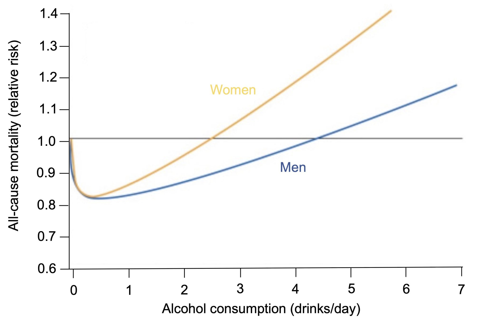
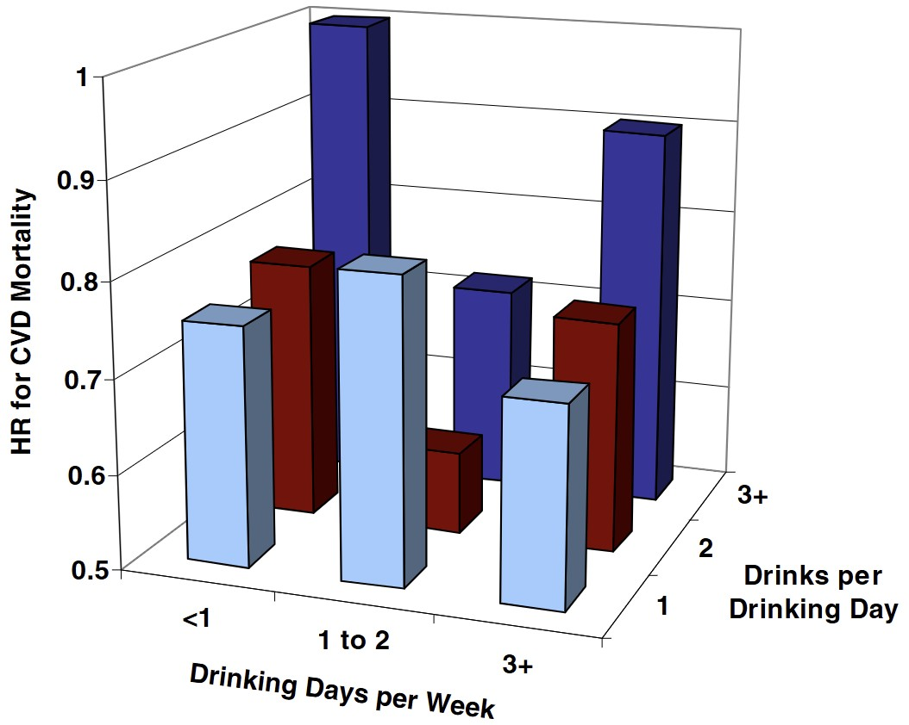

# A glass a day keeps the doctor away  

## **The crime scene**

Alcoholic drinks are very popular in the Republic of Harland. Researchers have long warned against consuming alcohol on a daily basis, though more Harlanders ignore this warning than they'd like to admit. 

However,  alcohol appears to be a tale of “the dose makes the poison”: drinking one or two alcoholic cocktails per week actually appears to decrease the all-cause mortality risk, by 18% for one weekly cocktail and by 9% for two weekly cocktails. 

The findings were derived from  a large cross-sectional survey in the Republic of Harland (N = 3,157 respondents) for which respondents were sampled in proportion to regional population sizes and asked about their current drinking habits. 

As a result, physicians in Ravenport have started to encourage patients to drink one or two alcoholic beverages of their choice per week to boost their health.

Wilbert Wright has quickly come to the conclusion that the analysis is flawed and is highly concerned about encouraging non-drinkers to drink moderately.  

### **Exhibit 1:** The relative risk of dying from any cause for different levels of alcohol intake (reference level = 1.0)  

### **Exhibit 2:** Cardiovascular disease mortality hazard ratios by drinking frequency and quantity  

Note: A greater hazard ratio means dying from cardiovascular disease is relatively more likely.  

## The interrogation 

1. According to Exhibit 1, for which amount of alcohol does mortality risk appear lowest?

2. Do women or men have a greater relative mortality risk at the same level of alcohol intake? 

3. Which alcohol intake levels are associated with increased mortality risk? 

4. Is alcohol consumption objective or self-reported data?

5. Are changes in drinking habits over time measured? Does the shape of the curve suggest causation or correlation between alcohol consumption and mortality?

6. Who is the reference group composed of in Exhibit 1 (all-cause mortality = 1.0)?

7. What matters more for mortality risk according to Exhibit 2: total alcohol intake or how it is spread across the week?

8. Is the sample size sufficient?

9. Could the relationship between alcohol consumption and mortality be impacted by smoking, diet, exercise, age, or income?

10.	Can we conclude that moderate drinking has protective health effects?  

## Answers

1. One alcoholic drink per day (if considering only full units) or a third of a drink is associated with the lowest estimated relative mortality risk from all causes. At this intake, the mortality risk for men is approximately 17% and for women 13% lower.

2. Women have a greater relative mortality risk than men at all alcohol intake levels, suggesting that to have the same relative mortality risk, women would need to drink less alcohol than men. 

3. For women, three or more drinks a day are associated with a greater relative mortality risk, while for men this is five or more drinks a day.

4. The data at hand is based on self-reported alcohol intake as indicated in a survey.

5. No, this is based on drinking habits at the time of conducting the survey only. The curve can therefore only indicate correlations but not whether there is a causal relationship and its direction.

6. This includes all survey respondents who report *currently* not drinking any alcohol. This means it includes life-time abstainers, those who drank alcohol but decided to quit, and those who untruthfully report that they do not drink.

7. Overall, the average daily alcohol intake appears to matter most: the biggest change in mortality risk comes from drinking greater daily amounts. However, Exhibit 2 shows that how consumption is spread across the week might also matter, with the relative cardiovascular mortality risk appearing lower when drinking is spread across more days of the week compared to drinking the same amount but drinking fewer than one day a week on average.

8. A sample of more than N = 3,000 is relatively large. What we don't learn from the exhibits is whether the sample is balanced across alcohol intake levels. Having very few non-drinkers or heavy drinkers for example could skew the figures.

9. The relative mortality risks presented do not indicate whether they have accounted for potential confounders. Smoking, diet, exercise, age, and income are all very plausible confounders. For instance, people who drink more might also smoke more on average and older people are more likely to be frail.

10. No, this cannot be inferred from the data presented, which is only observational from a single point in time. More importantly, however, there is a problem with the reference group, as it is very likely that in addition to lifetime abstainers it includes ex-drinkers, who may have been advised to stop drinking giving their health conditions. This suggests that respondents in the reference group may live in poorer health, alcohol intake aside, and therefore have a greater mortality risk.    

## What went wrong

The reference group was erroneously constructed. To have a cleaner comparison, the reference group should only include respondents for whom abstention has been a consistent life choice rather than those who stopped drinking, for medical or other reasons, as this could impact their mortality risk.  

## Background

The case demonstrates an evidence-based shift in health guidelines over the past decades. While in the early 1990s moderate alcohol consumption (20-30g per day) was believed to have protective effects as regards coronary heart disease risk (Renaud and de Lorgeril, 1992), recent evidence suggests that even minimal or light alcohol consumption can have negative health effects (Biddinger et al., 2022; Zhao et al., 2023). As a result, the World Health Organization now highlights that there is no safe level of alcohol intake.  

## Sources

- Biddinger, K. J., Emdin, C. A., Haas, M. E., Wang, M., Hindy, G., Ellinor, P. T., ... & Aragam, K. G. (2022). Association of habitual alcohol intake with risk of cardiovascular disease. JAMA network open, 5(3), e223849.
- Renaud, S. D., & de Lorgeril, M. (1992). Wine, alcohol, platelets, and the French paradox for coronary heart disease. The Lancet, 339(8808), 1523-1526.
- Zhao, J., Stockwell, T., Naimi, T., Churchill, S., Clay, J., & Sherk, A. (2023). Association between daily alcohol intake and risk of all-cause mortality: a systematic review and meta-analyses. JAMA network open, 6(3), e236185.
